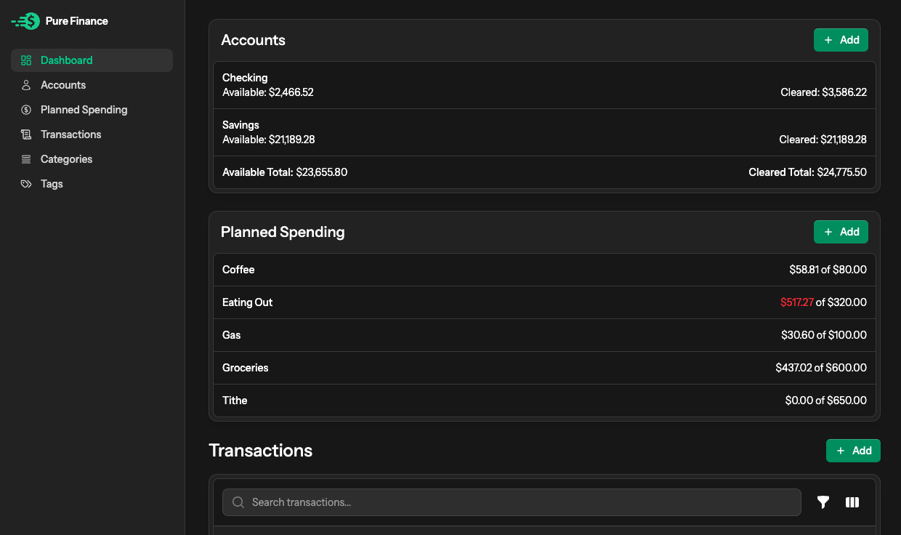

# Pure Finance

A fun and easy way to track your finances! Manage your expenses, income, and budget with ease.



## Features

Track Expenses & Income: Keep tabs on where your money goes.

Budgeting: Set goals and stay on top of your finances.

Secure & Private: Your financial data stays yours.

## Installation

After cloning this repo, create a local MySQL database with the name `pure_finance`, and connect to it.

Then, run the following commands from your project root:

```
cp .env.example .env
composer install
php artisan key:generate
php artisan migrate --seed
php artisan flux:activate
npm install
npm run dev
```

Now, open the project in your browser (Typically http://pure-finance.test) and use the following credentials to log in:

```
Email: admin@example.com
Password: password
```

## Testing

Run tests with:

`php artisan test`
